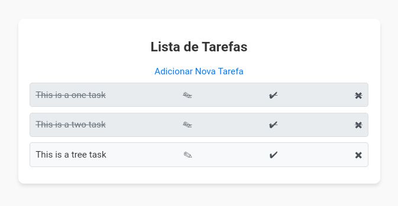

<div style="text-align: center;">

# Gerenciador de Tarefas



</div>

Este é um aplicativo web simples para gerenciar tarefas, criado usando Flask e SQLite. Ele permite que os usuários criem, editem, marquem como concluídas e excluam tarefas.

## Funcionalidades

- **Listagem de Tarefas:** Visualize todas as tarefas registradas.
- 
- **Criação de Tarefas:** Adicione novas tarefas com um título.
- **Edição de Tarefas:** Edite o título das tarefas existentes.
- **Marcar como Concluída:** Marque uma tarefa como concluída.
- **Excluir Tarefa:** Remova tarefas da lista.

## Estrutura do Banco de Dados

As tarefas são armazenadas em um banco de dados SQLite (`tasks.db`) com a seguinte estrutura:

- `id` (INTEGER): Identificador único da tarefa.
- `title` (TEXT): Título da tarefa.
- `completed` (BOOLEAN): Indica se a tarefa foi concluída (0 para não concluída, 1 para concluída).

## Configuração

1. **Pré-requisitos:**
   - Python 3.x
   - Flask

2. **Instalação das Dependências:**

   Execute o comando abaixo para instalar o Flask:
   ```bash
   pip install flask
   ```

3. **Inicialização do Banco de Dados:**

   O banco de dados é criado automaticamente ao iniciar o aplicativo pela primeira vez.

4. **Executando o Servidor:**

   Para iniciar o aplicativo, execute:
   ```bash
   python app.py
   ```

   O servidor estará disponível em `http://127.0.0.1:5000`.

## Estrutura de Arquivos

- `app.py`: Código principal do aplicativo.
- `tasks.db`: Banco de dados SQLite contendo as tarefas (gerado automaticamente).
- `templates/`: Diretório contendo os arquivos HTML (`tasks.html`, `create_task.html`, `edit_task.html`).

## Rotas do Aplicativo

- **`GET /`**: Página inicial com a lista de tarefas.
- **`GET, POST /create`**: Criação de uma nova tarefa.
- **`GET, POST /edit/<task_id>`**: Edição de uma tarefa existente.
- **`GET /complete/<task_id>`**: Marca uma tarefa como concluída.
- **`GET /delete/<task_id>`**: Exclui uma tarefa.
- 
# link para o site
• [to-do-list site](https://to-do-list-gpd9.onrender.com/)
